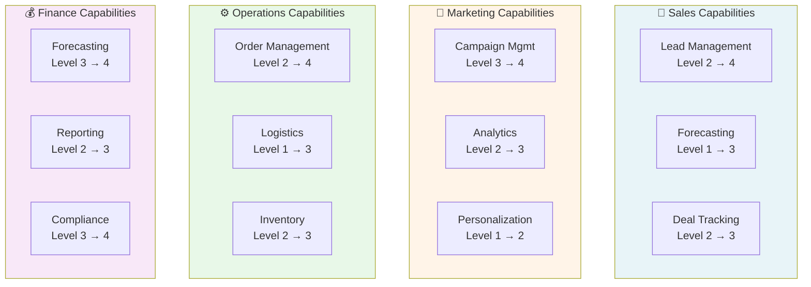
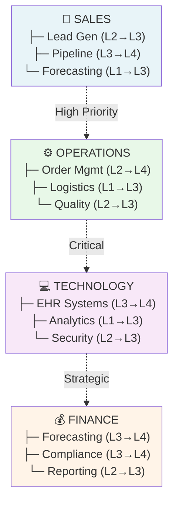

# Template: Capability Map (Business Capability Matrix)

## Purpose

Show organizational capabilities mapped to business functions, maturity levels, and ownership. Use for strategic planning, gap analysis, and transformation roadmaps.

## When to Use

- Enterprise architecture planning
- Digital transformation roadmaps
- Capability maturity assessment
- Organizational capability inventory
- Gap analysis (current vs. desired state)
- Strategic initiative planning
- Team skill mapping

## Template Structure

```
                 CURRENT STATE          DESIRED STATE (Year 2)
                 ─────────────          ──────────────────────
Business Domain  Capability  Maturity   Capability  Maturity   Owner    Priority
─────────────────────────────────────────────────────────────────────────────────
Sales            Lead Mgmt   Level 2    Lead Mgmt   Level 4    Sales VP   High
                 Forecasting Level 1    Forecasting Level 3    Analyst   High
                 
Marketing        Campaign    Level 3    Campaign    Level 4    Mktg Mgr  Medium
                 Analytics   Level 2    Analytics   Level 3    Analyst   High

Operations       Order Mgmt  Level 2    Order Mgmt  Level 4    Op Chief  High
                 Logistics   Level 1    Logistics   Level 3    Logistics High
```

## Mermaid Implementation



## Maturity Levels

### Standardized 5-Level Maturity Model

```
Level 1: Initial
  - Ad hoc, inconsistent processes
  - Relies on individuals, not systems
  - Example: "We handle orders manually, whoever's available"

Level 2: Repeatable
  - Basic processes defined
  - Some documentation and tools
  - Example: "We have an order form and basic tracking"

Level 3: Defined
  - Documented, standardized processes
  - Metrics being tracked
  - Example: "Order process documented, system tracks status"

Level 4: Managed
  - Automated, optimized processes
  - Continuous monitoring and improvement
  - Example: "Automated order processing, analytics dashboard"

Level 5: Optimized
  - Continuous innovation
  - AI/ML-driven optimization
  - Example: "AI predicts demand, auto-allocates inventory"
```

## Grid Layout

### Sales & Marketing Capabilities

```
           L1: Initial   L2: Repeatable  L3: Defined   L4: Managed  L5: Optimized
Lead Gen     ☐            ☑              ☐             ☐             ☐
Nurturing    ☐            ☐              ☑             ☐             ☐
Forecasting  ☑            ☐              ☐             ☐             ☐
Analytics    ☐            ☑              ☐             ☐             ☐
```

## Example: Health Organization Capabilities

```
CLINICAL CAPABILITIES
━━━━━━━━━━━━━━━━━━━━━━━━━━━━━━━━━━━━━━━━━━━━━━━━━━━━━━━━━

Capability          Current  Target   Gap   Owner          Priority
────────────────────────────────────────────────────────────────
Patient Assessment  L3       L4       1     Clinical Dir.  High
Treatment Planning  L2       L3       1     Medical Dir.   High
Outcome Tracking    L1       L3       2     Quality Dir.   Critical
Care Coordination   L2       L3       1     Operations VP  High
Patient Education   L1       L2       1     Nursing Dir.   Medium

OPERATIONAL CAPABILITIES
━━━━━━━━━━━━━━━━━━━━━━━━━━━━━━━━━━━━━━━━━━━━━━━━━━━━━━━━━

Appointment Mgmt    L3       L4       1     Scheduling Mgr High
Resource Mgmt       L2       L3       1     Operations     High
Billing             L2       L4       2     Finance VP     High
Supply Chain        L1       L3       2     Procurement    Critical
Staff Management    L2       L3       1     HR Director    Medium

TECHNOLOGY CAPABILITIES
━━━━━━━━━━━━━━━━━━━━━━━━━━━━━━━━━━━━━━━━━━━━━━━━━━━━━━━━━

EHR Management       L3       L4       1     IT Director    High
Data Analytics       L1       L3       2     Analytics Mgr  Critical
Cybersecurity        L2       L3       1     CISO           High
Cloud Infrastructure L1       L2       1     Infrastructure Medium
AI/ML Integration    L1       L3       2     Chief Data Off Critical
```

## Gap Analysis

### Identifying Gaps

```
Current Level (L2) ─── Gap (1 level) ─── Target Level (L3)

Example:
- Order Management: L2 (spreadsheet tracking) → L3 (system + automation)
- Gap: Automation, system integration, process documentation
- Investment needed: $150K system + $50K training
```

### Priority Matrix

```
HIGH IMPACT, LOW EFFORT
(Quick wins)
  └─ Forecasting improvement
  └─ Process documentation

HIGH IMPACT, HIGH EFFORT
(Strategic initiatives)
  └─ Analytics platform
  └─ EHR integration

LOW IMPACT, LOW EFFORT
(Nice to have)
  └─ Report optimization

LOW IMPACT, HIGH EFFORT
(Avoid)
  └─ Legacy system overhaul (low ROI)
```

## Implementation Roadmap

### Year 1 Roadmap Example

```
Q1 2026
├─ Lead Management L2→L3 (process docs + training)
├─ Forecasting L1→L2 (basic system)
└─ Order Mgmt L2→L3 (system optimization)

Q2 2026
├─ Campaign Analytics L2→L3 (dashboards)
├─ Logistics L1→L2 (tracking system)
└─ Inventory L2→L3 (system integration)

Q3 2026
├─ Lead Management L3→L4 (automation)
├─ Forecasting L2→L3 (predictive models)
└─ Operations review and planning

Q4 2026
├─ Year 2 capability targets set
├─ Budget allocation
└─ Team training and change management
```

## Data Model for Tracking

```json
{
  "capability": "Lead Management",
  "domain": "Sales",
  "current_level": 2,
  "target_level": 4,
  "owner": "VP Sales",
  "supporting_systems": ["Salesforce", "HubSpot"],
  "gap_analysis": {
    "process_gaps": ["Automated lead scoring", "AI qualification"],
    "technology_gaps": ["ML models", "Integration"],
    "people_gaps": ["Data analyst training"]
  },
  "investment_required": 250000,
  "timeline_months": 9,
  "expected_benefits": {
    "conversion_improvement": "25%",
    "time_savings": "40% of sales team time",
    "roi": "3.2x"
  }
}
```

## Ownership & Accountability

### Capability Owners

```
Each capability assigned to:
- Owner: Executive responsible (VP, Director)
- Sponsor: Funding/support
- Lead: Day-to-day management
- Team: Staff implementing changes
```

## Assessment Framework

### Self-Assessment Questions

```
Level 2 → 3 Assessment:
□ Processes documented and communicated?
□ Metrics defined and tracked?
□ Staff trained on procedures?
□ Tools support the process?
□ Compliance / audits passing?

Level 3 → 4 Assessment:
□ Process optimization ongoing?
□ Automation reducing manual effort >20%?
□ Real-time dashboards and alerts?
□ Continuous improvement cycles?
□ Benchmarking against industry?

Level 4 → 5 Assessment:
□ AI/ML enhancing capability?
□ Predictive analytics in use?
□ Self-healing/self-optimizing systems?
□ Continuous innovation culture?
□ Industry leadership position?
```

## Mermaid Example: Multi-Domain View



## Quality Checklist

- ✅ All business domains covered
- ✅ Capabilities clearly described
- ✅ Current maturity levels assessed
- ✅ Target maturity levels set
- ✅ Gaps clearly identified
- ✅ Ownership assigned
- ✅ Investment/effort estimated
- ✅ Timeline realistic
- ✅ Expected benefits quantified
- ✅ Success metrics defined

## Common Issues & Fixes

| Issue | Fix |
|-------|-----|
| Too many capabilities (>20) | Group into domains; create sub-maps |
| Maturity levels unclear | Use specific criteria (documented? automated?) |
| No ownership | Assign executive sponsor for each domain |
| Unrealistic targets | Validate against industry benchmarks |
| Missing dependencies | Show which capabilities enable others |

## Related Diagrams

- **Strategy Map**: Goals and strategic themes
- **Organizational Chart**: Who owns what
- **Value Stream**: End-to-end process flow
- **Technology Landscape**: Systems supporting capabilities

## Version Control

Save as: `{domain}-capability-map.md`

Example: `healthcare-capability-map.md`

## Implementation Steps

1. **Define domains** (Sales, Operations, Technology, Finance, etc.)
2. **List capabilities** under each domain (5-10 per domain)
3. **Assess current state** (L1-5 maturity)
4. **Set targets** (where do we want to be?)
5. **Identify gaps** and investments needed
6. **Assign owners** (accountability)
7. **Create roadmap** (phased improvements)
8. **Track progress** (quarterly reviews)
