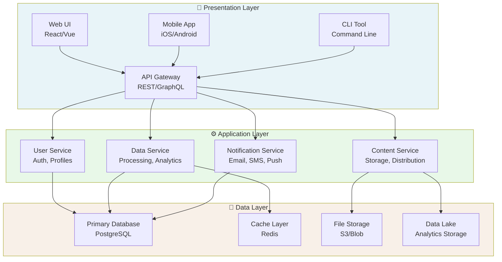
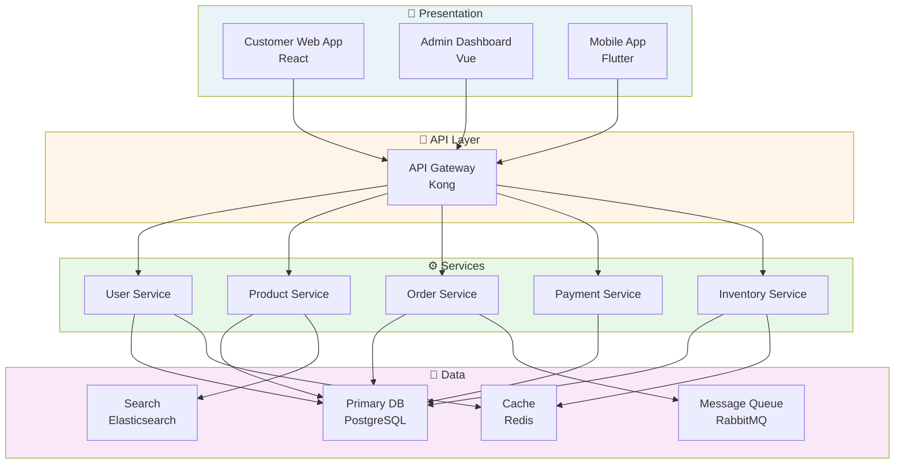

# Template: Layered Stack Architecture Diagram

## Purpose

Show the vertical architecture layers (presentation, business logic, data) with components at each layer and their interactions.

## When to Use

- System architecture overview
- Technology stack documentation
- Multi-tier application design
- Service-oriented architecture (SOA)
- Domain-driven design (DDD) architecture
- Cloud platform layering

## Template Structure

```
┌─────────────────────────────────────────────────────────────┐
│ Presentation Layer (User Interface)                         │
├─────────────────────────────────────────────────────────────┤
│  Web UI    │   Mobile App   │   API Gateway   │   CLI       │
├─────────────────────────────────────────────────────────────┤
│ Application / Business Logic Layer                          │
├─────────────────────────────────────────────────────────────┤
│  Service 1    │  Service 2    │  Service 3    │  Service 4  │
├─────────────────────────────────────────────────────────────┤
│ Persistence / Data Layer                                    │
├─────────────────────────────────────────────────────────────┤
│  Database  │  Cache  │  File Storage  │  Data Lake          │
└─────────────────────────────────────────────────────────────┘
```

## Mermaid Implementation



## Key Elements

### Layer 1: Presentation Layer
- **Components**: User-facing interfaces
- **Examples**: Web UI, mobile apps, REST APIs, CLI tools
- **Responsibility**: Receive user input, display results, handle sessions
- **Dependencies**: Calls application layer services

### Layer 2: Application/Business Logic Layer
- **Components**: Domain services, business rules, orchestration
- **Examples**: User Service, Order Service, Payment Service
- **Responsibility**: Core business logic, validation, workflows
- **Dependencies**: Calls data layer

### Layer 3: Data/Persistence Layer
- **Components**: Databases, caches, storage systems
- **Examples**: PostgreSQL, Redis, S3, Data warehouse
- **Responsibility**: Data storage, retrieval, indexing
- **Dependencies**: None (bottom layer)

## Design Principles

### 1. Clear Separation of Concerns
```
Each layer has a single responsibility:
Presentation  → Format & display
Application   → Business logic
Data          → Storage & retrieval
```

### 2. Unidirectional Dependencies
```
Presentation
    ↓
Application
    ↓
Data

(Never call upward: Data should never call Application)
```

### 3. Layer Isolation
```
- Layers communicate through defined interfaces
- Direct database access from UI = bad (violates separation)
- Use service layer to mediate
```

## Common Patterns

### 3-Tier Architecture
```
Presentation (Web, Mobile)
    ↓
Business Logic (Services)
    ↓
Data Access (Databases)
```

### 4-Tier with API Layer
```
Presentation (Web, Mobile, 3rd party)
    ↓
API Layer (REST, GraphQL)
    ↓
Business Logic (Services, Rules)
    ↓
Data (Databases, Cache, Files)
```

### 5-Tier (Enterprise Pattern)
```
Presentation (UI)
    ↓
API Gateway
    ↓
Business Logic (Services)
    ↓
Data Access Layer (DAL)
    ↓
Persistence (DB, Cache, Storage)
```

## Example: E-Commerce Platform



## Alt Text Guidelines

```
A layered stack architecture showing:

Presentation Layer (top):
- Web UI (React)
- Mobile App (iOS/Android)
- API Gateway (REST)

Application Layer (middle):
- User Service
- Product Service  
- Order Service
- Payment Service

Data Layer (bottom):
- PostgreSQL database
- Redis cache
- Elasticsearch
- RabbitMQ queue

Arrows show data flow downward from presentation → services → data.
All communication flows through API Gateway.
```

## Quality Checklist

- ✅ Layers clearly labeled and separated
- ✅ Components within each layer identified
- ✅ Data flow direction shown (unidirectional)
- ✅ Dependencies between layers explicit
- ✅ Technology choices labeled (PostgreSQL, Redis, etc.)
- ✅ No reverse dependencies (data calling application)
- ✅ Layer responsibilities documented
- ✅ Diagram title and legend clear

## Common Issues & Fixes

| Issue | Fix |
|-------|-----|
| Unclear which layer is which | Add clear layer labels and background colors |
| Bidirectional arrows (violates layering) | Remove reverse dependencies |
| Too many components per layer | Group into sub-layers or split diagram |
| Technology not specified | Label with specific products (PostgreSQL, not "DB") |
| Missing API/gateway layer | Add if multiple presentation types exist |

## Related Diagrams

- **System Context**: External systems and actors
- **Container**: Deployment-level components
- **C4 Model Level 2**: Multi-tier detail
- **Network Flow**: Data flow between systems
- **Deployment Topology**: Infrastructure and scaling

## Version Control

Save as: `{domain}-layered-stack.md`

Example: `ecommerce-layered-stack.md`

## Next Steps

1. **Identify layers** in your system (presentation, business, data)
2. **List components** at each layer
3. **Draw arrows** showing communication (top→bottom)
4. **Label technologies** (PostgreSQL, Redis, etc.)
5. **Validate** with technical team (dependencies correct?)
6. **Share** with stakeholders for feedback
