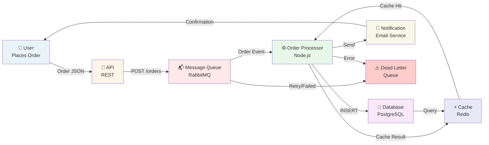
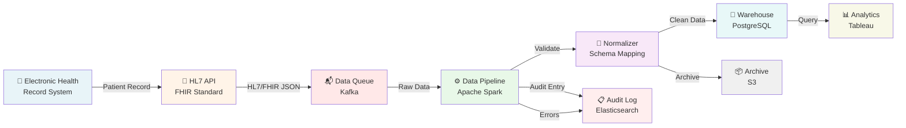
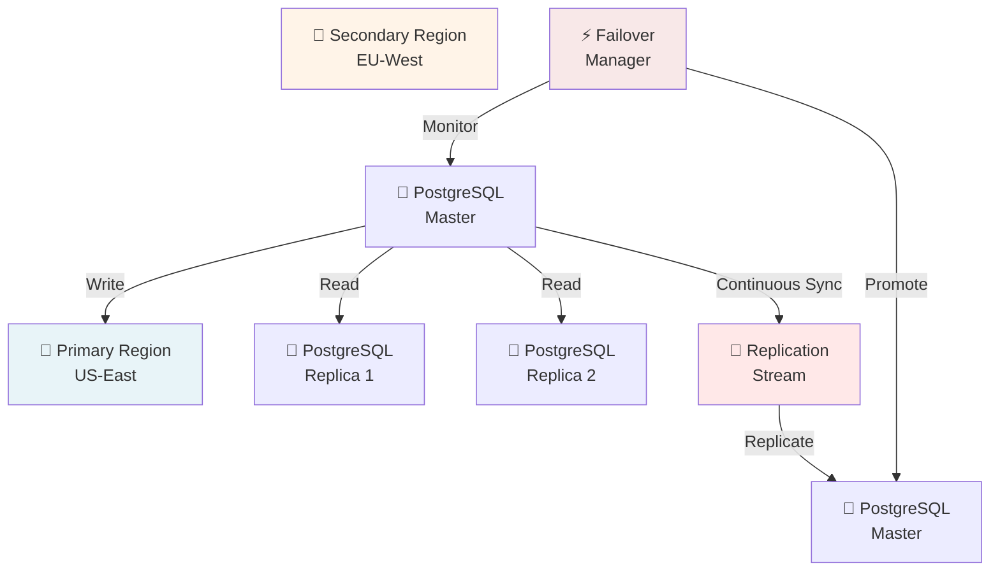

# Template: Network & Data Flow Diagram

## Purpose

Show data flow between systems, components, and external services. Emphasize what data moves where, transformation, and protocols.

## When to Use

- Integration architecture
- Data pipeline documentation
- API and service interactions
- Real-time data flows
- ETL (Extract-Transform-Load) processes
- Message queues and event-driven systems
- Cross-system communication

## Template Structure

```
Source                  Transformation        Destination
┌──────────────┐       ┌──────────────┐      ┌──────────────┐
│  System A    │──────>│  Service B   │─────>│  Database    │
│  (Orders)    │  JSON │  (Processor) │ SQL  │  (Persisted) │
└──────────────┘       └──────────────┘      └──────────────┘
                             │
                             │ Failed
                             ↓
                       ┌──────────────┐
                       │  Dead Letter  │
                       │  Queue        │
                       └──────────────┘
```

## Mermaid Implementation



## Key Elements

### Data Sources
```
- User actions (clicks, form submissions)
- External APIs (weather, payment, geolocation)
- Scheduled jobs (batch processing)
- Sensor data (IoT devices)
- Database queries
```

### Transformations
```
- Data validation and cleaning
- Format conversion (JSON → XML, CSV)
- Aggregation and summarization
- Encryption/decryption
- Filtering and enrichment
```

### Data Destinations
```
- Databases (storage)
- Caches (performance)
- Message queues (async processing)
- External services (APIs)
- Data warehouses (analytics)
- User interfaces (display)
```

### Flow Directions
```
→  Synchronous (request-response)
⇒  Asynchronous (fire-and-forget)
⟲  Bidirectional (two-way communication)
⟳  Circular (event-driven or retry loops)
```

## Design Patterns

### Synchronous Request-Response
```
Client ──request──> Server ──response──> Client
```

### Asynchronous Message Queue
```
Producer ──event──> Queue ──message──> Consumer
                                            ↓
                                        Process
                                            ↓
                                        Success/Failure
```

### Event-Driven
```
Event Source ──event──> Event Bus ──routes to──> Subscribers
                                                    │
                                                    ├─ Handler A
                                                    ├─ Handler B
                                                    └─ Handler C
```

## Example: Health Data Pipeline



## Protocol Specifications

### Data Format Labels
```
─[JSON]─      REST API
─[XML]─       SOAP, EDI
─[CSV]─       Batch file transfers
─[Binary]─    Protocol buffers, Avro
─[Event]─     Message queue
```

### Protocol Types
```
HTTPS       Secure web APIs
AMQP        Message queues (RabbitMQ)
Kafka       Streaming data
gRPC        Microservices
SFTP        Secure file transfer
```

## Error Handling Patterns

### Retry Logic
```
Service A ──request──> Service B
                           │
                      Process
                           │
                    ✓ Success
                    ✗ Error (retry up to 3x)
                           │
                      Dead Letter Queue
```

### Circuit Breaker
```
Service A ──check state──> Service B
                             │
                     Closed (normal)
                     Open (stop calls, return error)
                     Half-Open (test recovery)
```

## Data Flow Metrics

Label flows with performance data:
```
──[500MB/day]──
──[<100ms]──
──[99.9% reliability]──
```

## Example: Multi-Region Replication



## Alt Text Guidelines

```
Network data flow showing:
- Source: [Source system] generates/sends [data type]
- Flow: Via [protocol] to [destination]
- Transformation: [What processing happens]
- Error handling: Failed items sent to Dead Letter Queue
- Monitoring: [Where flow is logged/monitored]

Format: [Source] --[protocol]--> [Transformation] --[format]--> [Destination]
```

## Quality Checklist

- ✅ All data sources labeled
- ✅ Flow directions clear (→ vs ⇒)
- ✅ Data format specified (JSON, XML, etc.)
- ✅ Protocol specified (HTTPS, AMQP, etc.)
- ✅ Transformations shown and labeled
- ✅ Error handling paths included
- ✅ Latency expectations noted (if critical)
- ✅ External systems clearly marked
- ✅ No missing steps in pipeline

## Common Issues & Fixes

| Issue | Fix |
|-------|-----|
| Unclear data format | Label each flow with format (JSON, CSV) |
| Missing error paths | Add Dead Letter Queue and retry logic |
| Synchronous vs async unclear | Use → for sync, ⇒ for async |
| Performance expectations missing | Add latency/throughput labels |
| External APIs unlabeled | Clearly mark 3rd party services |

## Related Diagrams

- **Layered Stack**: Architectural layers
- **System Context**: External systems at high level
- **Deployment Topology**: Infrastructure and zones
- **Sequence Diagram**: Temporal ordering of calls

## Version Control

Save as: `{domain}-data-flow.md`

Example: `payment-processing-flow.md`

## Implementation Steps

1. **Identify sources** (where data originates)
2. **Map flow** (how data moves between systems)
3. **Label protocols** (HTTPS, AMQP, etc.)
4. **Show transformation** (data processing)
5. **Include error paths** (failures, retries, dead letters)
6. **Add timing** (latency, throughput)
7. **Review** with team for accuracy
8. **Document** in version control
