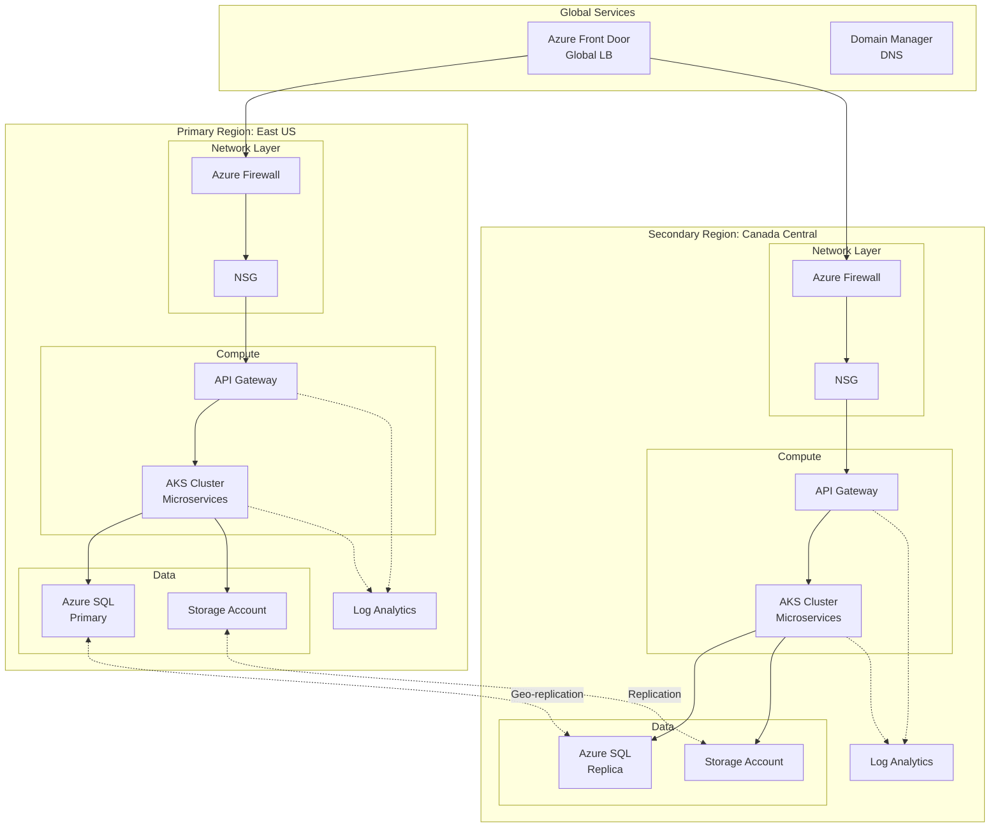

# Example: Cloud Deployment Topology Diagram

## Context
Multi-region cloud deployment on Azure with failover, load balancing, and security layers.

## Input Description
```
We deploy on Azure across two regions: East US (primary) and Canada Central (secondary).
Each region has:
- API Gateway for routing
- Kubernetes cluster (AKS) with microservices
- Azure SQL Database
- Storage accounts

Traffic goes through Azure Front Door for global load balancing.
API Gateway sits in front of Kubernetes.
Microservices run as containers.
Database has geo-replication to the secondary region.
Network security is managed by NSGs and Azure Firewall.
Logging goes to Log Analytics in both regions.
```

## Output (Mermaid Diagram)


## Layout Notes
- **Global Services** (top): Entry point, global routing
- **Regions** (left/right): Self-contained deployment units
- **Network → Compute → Data**: Logical flow within each region
- **Dotted arrows**: Replication and monitoring flows

## Resilience Features Highlighted
- Multi-region deployment (East US + Canada Central)
- Azure Front Door for global load balancing and failover
- Database geo-replication (read replicas, failover support)
- Separate network security per region
- Centralized logging per region

## Quality Checklist
- ✅ Clear separation of regions
- ✅ All resources have at least one connection
- ✅ Replication relationships shown (dotted)
- ✅ Logical grouping (network, compute, data)
- ✅ Disaster recovery path visible (AFD → secondary region)
- ✅ Readable without excessive zoom

## PPTX Integration
**Slide title**: "Multi-Region Cloud Architecture"
**Presenter notes**: 
- "We're deployed across two regions for resilience"
- "Azure Front Door routes traffic to the nearest healthy region"
- "Database replication ensures data consistency"
- "If East US fails, traffic automatically routes to Canada Central"
- "RTO: <5 minutes | RPO: <1 minute"

## Color Coding (Optional)
- Blue: Networking components
- Green: Compute resources
- Orange: Data storage
- Purple: Monitoring/Logging
- Gray: Cross-region connections
