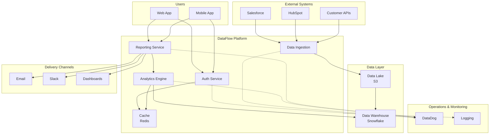

# Example: Microservices System Context Diagram

## Context
A SaaS platform with multiple microservices, integrations, and external systems.

## Input (Natural Language)
```
We have a multi-tenant SaaS platform called "DataFlow". 
Users log in via our web app or mobile app. 
The system has core services: auth service, data ingestion, analytics engine, and reporting.
Data comes from customer integrations (Salesforce, HubSpot, custom APIs).
We store data in a data lake (S3) and use a data warehouse (Snowflake) for analytics.
Reports are delivered via email, Slack, or embedded dashboards.
Monitoring and logging go to DataDog.
```

## Output (Mermaid Diagram Code)


## Visual Notes
- **Users** (blue box): External actors using the system
- **System** (green box): Core platform services
- **Data** (orange box): Storage and warehouse systems
- **External** (purple box): Third-party data sources
- **Delivery** (red box): Output channels
- **Ops** (gray box): Monitoring and observability
- **Solid arrows**: Data/request flow
- **Dotted arrows**: Monitoring/logging flow

## Quality Checklist
- ✅ Clear flow direction (left → right, top → bottom)
- ✅ No orphan nodes (all systems have at least one connection)
- ✅ Relationships labeled implicitly (solid = data flow, dotted = monitoring)
- ✅ Readable at 50% zoom (tested)
- ✅ Consistent naming (CamelCase for services)
- ✅ Grouped by concern (Users, System, Data, External, Delivery, Ops)

## Alternative: C4 Context Level
If this is part of a larger architecture:
- **System**: DataFlow Platform (one box)
- **External Systems**: Customers, data sources, monitoring
- **Users**: End users, admins, analysts

## SVG Export Notes
- Mermaid can export to SVG
- Add title: "DataFlow - System Context Diagram"
- Suggested dimensions: 1200x800px
- Color palette: Blue (#0066CC), Green (#00CC66), Orange (#FF9900), Purple (#9933FF), Red (#CC0000), Gray (#666666)
